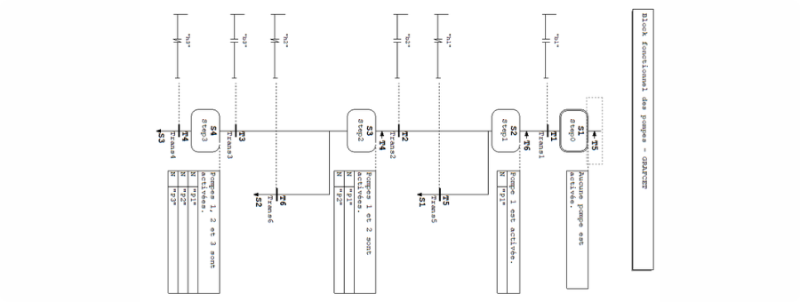
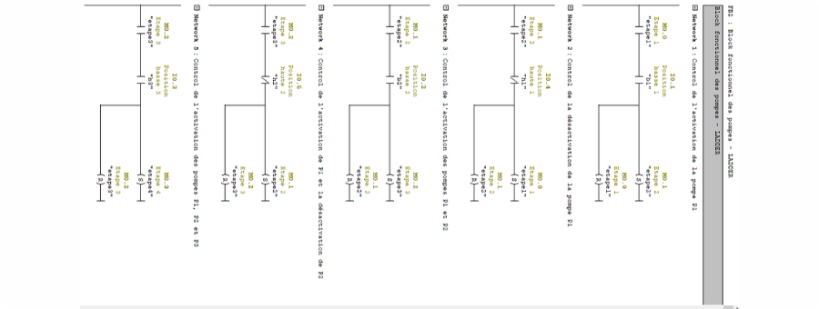
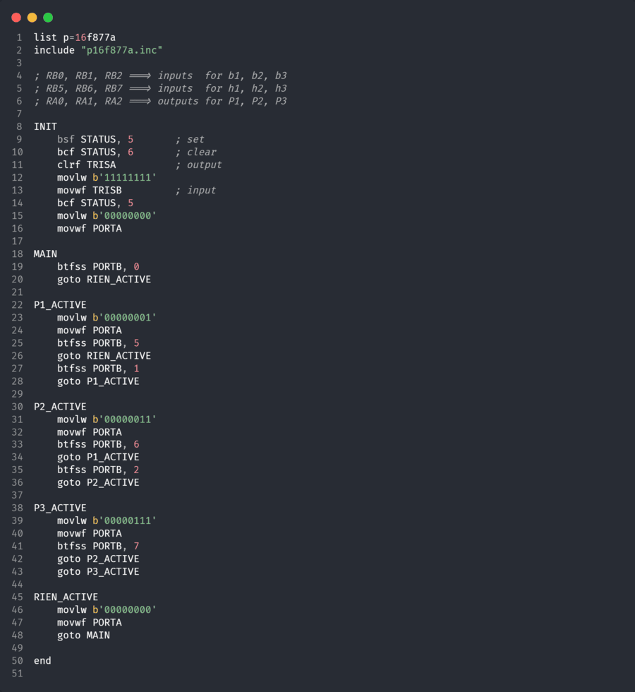

 

# Water Pumps Automation Project

This repository contains several implementations for automating the control of water pumps in a reservoir. The goal is to ensure optimal pump operation through different programming techniques and platforms.

## Implementations

This project includes the following versions:

- **STEP7 Graph Program:** A sequential control system using Siemens STEP7:

https://github.com/user-attachments/assets/cc07d29a-48c4-4092-b2ac-6a5849e5850a

- **STEP7 Ladder Program:** Ladder logic for Siemens PLC systems:

https://github.com/user-attachments/assets/2134e23a-c7c5-4203-85d6-5477eb4468c1

- **PIC16F877A Assembly Program:** An assembly program for controlling the water pumps using the PIC16F877A microcontroller.

- **Proteus Simulation:** A complete simulation of the assembly program using PROTEUS.

https://github.com/user-attachments/assets/d79d101a-bff1-4c57-a498-dabe98733932
